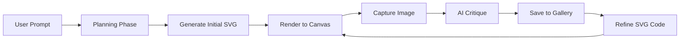

<div align="center">

# 🎨 Sketch AI: Idea-To-SVG

### *Infinite Refinement Loop for SVG Graphics*

[](LICENSE)
[](https://ai.google.dev/)
[](https://react.dev/)
[](https://www.typescriptlang.org/)

*An AI-powered creative tool that transforms ambiguous ideas into refined SVG graphics through continuous generation, critique, and improvement cycles.*

[View Demo](https://ai.studio/apps/drive/1WE1yPSj71-goO0j6uwvI66g2fUxumb85) • [Report Bug](https://github.com/RONITERVO/Idea-To-SVG/issues) • [Request Feature](https://github.com/RONITERVO/Idea-To-SVG/issues)

</div>

---

## ✨ What Makes This Special?

**Sketch AI** isn't just another AI image generator—it's a creative partner that never settles. Using Google's powerful Gemini 3 Pro model, it creates a continuous feedback loop where SVG graphics are:

1. **🧠 Planned** - Analyzes your ambiguous prompt and creates a detailed artistic plan
2. **🎨 Generated** - Creates an initial SVG graphic based on the plan
3. **📸 Rendered** - Captures the visual output for evaluation
4. **🔍 Critiqued** - Harshly but constructively evaluates the result against your original idea
5. **✏️ Refined** - Rewrites the SVG code to address all critique points
6. **🔄 Repeated** - Continues this cycle indefinitely, with each iteration improving upon the last

All iterations are automatically saved to a beautiful sketchpad-inspired gallery, complete with thumbnails and AI critiques, so you can watch your idea evolve in real-time.

---

## 🎯 Key Features

### 🤖 AI-Powered Infinite Loop
- **Gemini 3 Pro Reasoning**: Uses extended thinking budgets (up to 4096 tokens) for deep SVG code refinement
- **Vision Analysis**: Evaluates rendered graphics using Gemini's vision capabilities
- **Continuous Improvement**: Never stops refining until you're satisfied
- **Smart Error Recovery**: Automatically retries on failures with exponential backoff

### 🖼️ Gallery & History
- **Automatic Thumbnails**: Every iteration captured as a base64 image
- **Persistent Storage**: Uses IndexedDB for browser-based history
- **Rich Metadata**: Tracks prompts, critiques, timestamps, and iteration numbers
- **Batch Operations**: Select and delete multiple iterations at once
- **Manual Entry**: Add your own SVG creations to the gallery

### 🎨 Beautiful Sketchpad UI
- **Hand-Drawn Aesthetic**: Custom fonts (Caveat, Patrick Hand, Architects Daughter)
- **Paper Textures**: Authentic notebook lines and torn paper effects
- **Sketchy Borders**: CSS-based hand-drawn border effects
- **Tape & Doodles**: Decorative elements that bring the sketchpad to life
- **Responsive Design**: Works beautifully on desktop and mobile

### 📦 Export & Share
- **SVG Download**: Export any iteration as a standard SVG file
- **Code Copying**: One-click copy of clean SVG code
- **Full-Screen Modal**: Detailed view with critique and code snippets

---

## 🚀 Quick Start

### Using GitHub Pages (Recommended for End Users)

This app is deployed on GitHub Pages and requires **no installation**! 

1. **Visit the App**: Navigate to the deployed GitHub Pages URL
2. **Enter Your API Key**: On first visit, you'll be prompted to enter your Gemini API key
   - Get a free API key at [Google AI Studio](https://ai.google.dev/)
   - Your key is stored **locally in your browser** and never sent to our backend
   - The key remains private and is only used for direct API calls to Google's Gemini service
3. **Start Creating**: Once your key is set, you can start generating SVG graphics!

> **🔒 Security Note**: In API-key mode, your key stays on-device and calls Gemini directly. In Android token mode, prompts/images are processed through Firebase Functions for token accounting and purchase verification.

### Deploying to GitHub Pages

This repository is configured to deploy with **GitHub Actions** using `.github/workflows/deploy.yml`.

1. Go to **Settings → Pages** in your GitHub repository.
2. Set **Source** to **GitHub Actions**.
3. Push your changes to the `main` branch.
4. Open the **Actions** tab and wait for **Deploy to GitHub Pages** to finish.
5. After it succeeds, open: `https://<your-username>.github.io/Idea-To-SVG/`

> **Important**: `vite.config.ts` already includes `base: "/Idea-To-SVG/"`, which is required for project-site URLs like `/<repo-name>/`.

### Deploying to GitHub Pages (Local CLI)

If you prefer deploying from your machine instead of Actions:

1. In **Settings → Pages**, set **Source** to **Deploy from a branch**.
2. Select branch **`gh-pages`** and folder **`/ (root)`**.
3. Run:

```bash
npm run deploy
```

If you hit Windows `ENAMETOOLONG` during publish cleanup, run this once and retry deploy:

```bash
npm run deploy:clean-cache
npm run deploy
```

If the existing remote `gh-pages` history is bloated, reset it once and redeploy:

```bash
npm run deploy:reset-branch
npm run deploy
```

> `deploy` uses `gh-pages --add` to avoid large cleanup argument lists on Windows.

### Prerequisites for Local Development

- **Node.js** (v18 or higher)
- **Gemini API Key** - Get yours free at [Google AI Studio](https://ai.google.dev/)

### Installation for Local Development

```bash
# Clone the repository
git clone https://github.com/RONITERVO/Idea-To-SVG.git
cd Idea-To-SVG

# Install dependencies
npm install

# (Optional) Set up a dev fallback API key for local development only
echo "GEMINI_API_KEY=your_gemini_api_key_here" > .env.local

# Start the development server
npm run dev
```

The app will be available at `http://localhost:3000`

> **Note**: The `.env.local` file is optional for local development. The app will work the same way as in production, prompting you to enter your API key through the UI. The fallback is only used if no key is found in localStorage during development.

### Build for Production

```bash
# Build the app
npm run build

# Preview the production build
npm run preview
```

> **Production Builds**: Production builds are completely free of embedded API keys. Users must provide their own API key through the UI, which is stored in browser localStorage.

---

## 📖 How to Use

### Setting Up Your API Key

1. **First Time Setup**: When you first open the app, you'll see a modal prompting you to enter your Gemini API key
2. **Getting an API Key**: 
   - Visit [Google AI Studio](https://ai.google.dev/)
   - Sign in with your Google account
   - Create or select a project
   - Generate an API key (starts with "AIza")
3. **Enter Your Key**: Paste your API key into the modal and click "Save Key"
4. **Managing Your Key**: Click the key icon (🔑) in the header to view or update your API key at any time

### Creating SVG Graphics

1. **Enter Your Idea**: Type any ambiguous prompt into the sketchpad (e.g., "a peaceful forest", "abstract energy", "geometric harmony")

2. **Start Sketching**: Click the "Start Sketching" button or press `Ctrl+Enter` / `Cmd+Enter`

3. **Watch It Work**: The AI will:
   - Plan the SVG composition
   - Generate the initial graphic
   - Capture and critique it
   - Refine and improve continuously

4. **Browse the Gallery**: Every iteration appears in the gallery wall below with:
   - Thumbnail preview
   - Iteration number
   - Timestamp
   - AI critique (viewable in detail)

5. **Interact with Results**:
   - Click any iteration to view full details in a modal
   - Download individual SVGs
   - Copy clean SVG code
   - Select multiple items for batch deletion

6. **Stop When Ready**: Click "Stop Drawing" to halt the refinement loop

---

## 🏗️ Architecture

### Tech Stack

| Category | Technology |
|----------|-----------|
| **Frontend Framework** | React 19.2.4 with TypeScript |
| **Build Tool** | Vite 6.2.0 |
| **Styling** | Tailwind CSS (CDN) + Custom CSS |
| **AI Model** | Google Gemini 3.1 Pro (`gemini-3.1-pro-preview`) |
| **Storage** | IndexedDB (browser-local) |
| **Icons** | Lucide React |
| **Fonts** | Google Fonts (Caveat, Patrick Hand, Architects Daughter) |

### Project Structure

```
Idea-To-SVG/
├── components/          # React components
│   ├── ActiveStage.tsx  # Main canvas and input area
│   ├── Gallery.tsx      # Iteration gallery grid
│   ├── Header.tsx       # App header with logo
│   ├── HistorySidebar.tsx
│   ├── ManualEntry.tsx  # Manual SVG input form
│   ├── Modal.tsx        # Detail view modal
│   ├── Controls.tsx
│   ├── SVGCanvas.tsx    # SVG rendering canvas
│   └── SketchSvgFilters.tsx
├── services/
│   ├── gemini.ts        # Gemini API integration
│   └── db.ts            # IndexedDB operations
├── App.tsx              # Main app component & loop logic
├── types.ts             # TypeScript interfaces
├── index.tsx            # App entry point
├── index.html           # HTML template
└── vite.config.ts       # Vite configuration
```

### The Refinement Loop



The loop continues indefinitely, with each iteration:
- **Using feedback** from previous critiques
- **Improving quality** based on identified issues
- **Saving progress** immediately to the gallery
- **Learning patterns** that better match the prompt

---

## 🔧 Configuration

### Environment Variables

Create a `.env.local` file in the root directory:

```env
GEMINI_API_KEY=your_gemini_api_key_here
```

> **Note**: Vite automatically loads this variable and maps it to `process.env.API_KEY` internally (see `vite.config.ts`).

### Customization

#### Change Models

```typescript
const MODEL_REASONING = 'gemini-3.1-pro-preview';
const MODEL_VISION = 'gemini-3.1-pro-preview';
```

#### UI Theme Colors

In `index.html`, modify CSS custom properties:

```css
:root {
  --accent: 18 60% 55%;  /* Main accent color */
  --primary: 25 20% 25%; /* Primary buttons */
  /* ... more variables */
}
```

---

## 🎨 Features in Detail

### SVG Code Cleaning

The app includes robust SVG cleaning to handle AI-generated code:

- Removes markdown code blocks
- Extracts pure SVG from mixed content
- Converts React-style props to standard SVG
- Handles camelCase to kebab-case conversion
- Strips framework artifacts (React, Vue, etc.)

### Smart Retry Logic

API calls include automatic retry with exponential backoff:
```typescript
retries: 3
initial delay: 2 seconds
max delay: 8 seconds
```

### Real-Time Updates

- Gallery updates instantly when iterations complete
- Critique appears while the next iteration generates
- Modal views show live updates from the gallery
- No page refresh needed

---

## 🐛 Troubleshooting

### API Errors

**Problem**: "API call failed" messages appear

**Solutions**:
- Verify your `GEMINI_API_KEY` in `.env.local` is correct
- Check your Gemini API quota at [Google AI Studio](https://ai.google.dev/)
- Ensure you have internet connectivity
- Wait for automatic retry (app retries 3 times with backoff)

### SVG Not Rendering

**Problem**: Blank canvas or broken graphics

**Solutions**:
- Check browser console for SVG parsing errors
- The AI may have generated invalid SVG—wait for next iteration
- Try a more specific prompt
- Manually inspect the SVG code in the modal

### Gallery Not Saving

**Problem**: Iterations disappear on refresh

**Solutions**:
- Check if IndexedDB is enabled in your browser
- Try a different browser (Chrome, Firefox, Edge recommended)
- Check browser storage quota
- Clear browser data and restart

### Build Failures

**Problem**: `npm run build` fails

**Solutions**:
```bash
# Clear cache and reinstall
rm -rf node_modules package-lock.json
npm install

# Clear Vite cache
rm -rf .vite

# Try build again
npm run build
```

---

## 🤝 Contributing

Contributions are what make the open-source community amazing! Any contributions you make are **greatly appreciated**.

### How to Contribute

1. Fork the Project
2. Create your Feature Branch (`git checkout -b feature/AmazingFeature`)
3. Commit your Changes (`git commit -m 'Add some AmazingFeature'`)
4. Push to the Branch (`git push origin feature/AmazingFeature`)
5. Open a Pull Request

### Development Guidelines

- Follow existing code style (TypeScript, functional components)
- Add comments for complex logic
- Test your changes with multiple prompts
- Ensure the build passes: `npm run build`
- Update README if you add features

---

## 📝 License

Distributed under the Apache License 2.0. See [`LICENSE`](LICENSE) for more information.

---

## 🙏 Acknowledgments

- **Google AI** for the powerful Gemini API
- **Lucide** for beautiful React icons
- **Vite** for lightning-fast dev experience
- **React team** for the amazing framework
- **Open source community** for inspiration

---

## 📬 Contact & Support

- **Creator**: [@RONITERVO](https://github.com/RONITERVO)
- **Project Link**: [https://github.com/RONITERVO/Idea-To-SVG](https://github.com/RONITERVO/Idea-To-SVG)
- **Issues**: [Report a bug or request a feature](https://github.com/RONITERVO/Idea-To-SVG/issues)

---

<div align="center">

**Made with ✏️ pencil shavings & pixels**

⭐ Star this repo if you find it useful!

</div>
